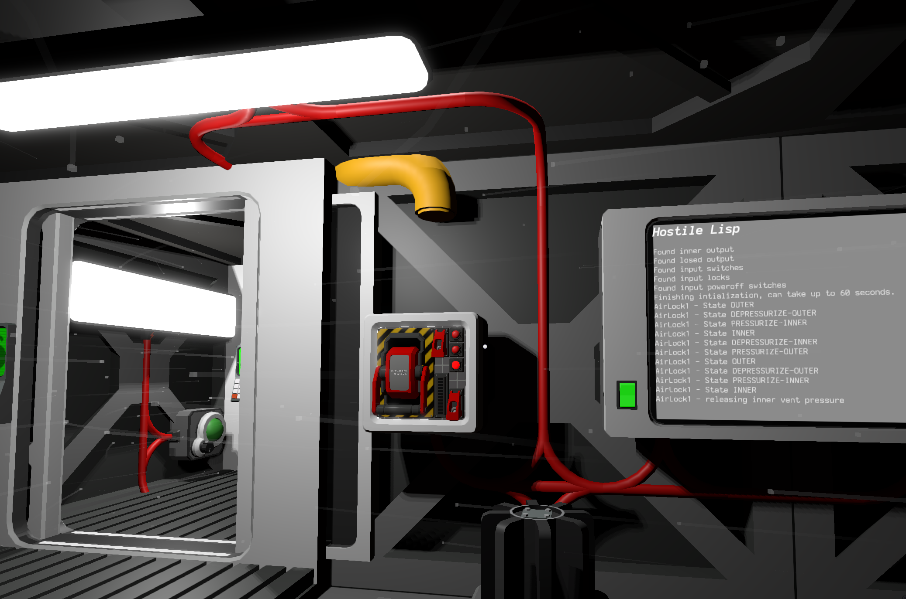

This is a collection of example scripts for use with the Stationeers [Hostile Lisp mod](https://steamcommunity.com/sharedfiles/filedetails/?id=3592162399)

If you want to showcase your script feel free to create a pull request.

## [Unpowered Airlock](unpowered-airlock.lisp)

This implements an airlock that saves power by shutting down if nobody is nearby.

## [Auto Power](auto-power.lisp)
A script that automatically shuts down machines when power becomes too low